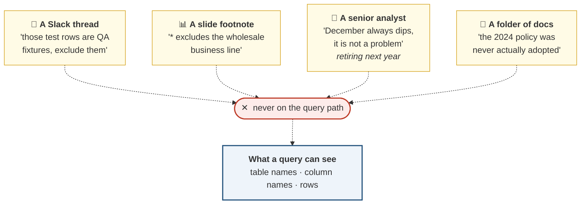
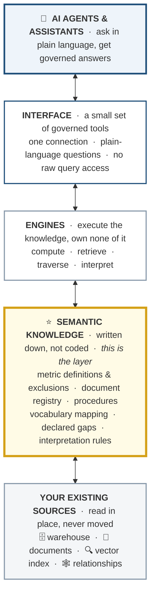
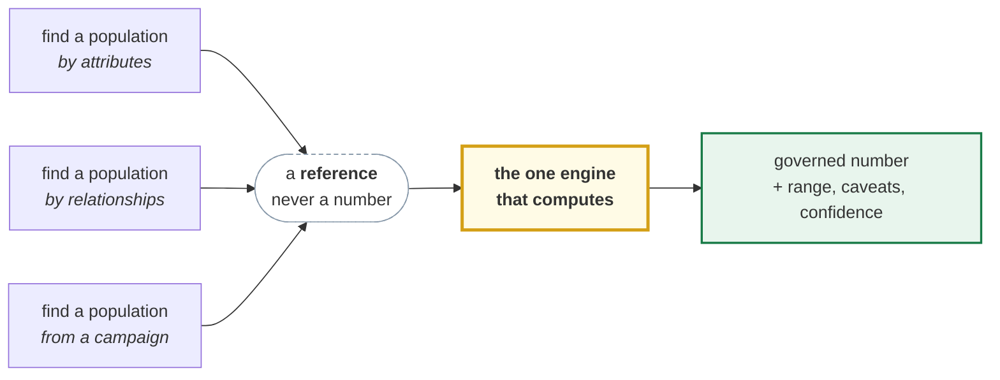

# A Semantic Layer for AI Agents

**Why your organization probably needs one, what it is, and a working reference
implementation you can run.**

> Every organization already has a semantic layer. It lives in analysts' heads,
> Slack threads, and the tribal knowledge of who to ask. The question is whether a
> machine can reach it.

**Jump to:** [The problem](#the-problem) · [Why AI makes it urgent](#why-ai-turns-a-nuisance-into-a-liability) · [What a semantic layer is](#what-a-semantic-layer-is) · [Design principles](#the-design-principles) · [Adopting one](#what-adoption-actually-costs) · [The reference implementation](#the-reference-implementation)

---

## The problem

Your warehouse holds facts. It does not hold what those facts **mean**.

| Your data has | Your data does not say |
|---|---|
| A `status` column | that `status='test'` rows are QA artifacts someone wrote into production in 2019 |
| A `revenue` figure | whether marketing counts it net of refunds while finance counts it gross, and that both are right |
| A `channel` column | that one of those channels is a separate business line with different unit economics |
| An `opened` flag on emails | that a third of those opens were image prefetches no human performed |
| A folder of policies | which one is currently in force |

None of this is exotic. It is **the normal state of a warehouse that grew over
time**, and every organization past a certain age has all five.

### Where the missing meaning actually lives

It is not lost. It is simply nowhere a query can reach.



**Documents are worse than tables.** A policy written in 2024 does not say *"I was
replaced in 2026."* Nobody went back to stamp it, because the person writing the
replacement had no way to reach every copy of the old one. It reads as confident
and complete, because it was, once.

---

## Why AI turns a nuisance into a liability

Humans have always worked around this. An analyst knows to ask, knows who to ask,
and knows when a number looks wrong. **That instinct is the layer**, and it does
not survive contact with automation.

| | A human analyst | An AI agent |
|---|---|---|
| **Encounters an ambiguous column** | asks someone | picks an interpretation |
| **Finds two conflicting documents** | notices, escalates | cites the more relevant-sounding one |
| **Hits a gap in the data** | says "we don't track that" | finds an adjacent number and reasons about it |
| **Produces a wrong answer** | usually hedges | states it fluently, with confidence |
| **Volume** | dozens of questions a week | thousands, unreviewed |

The failure mode is specific and it is the dangerous one:

> An agent given raw data access does not fail loudly. It answers **confidently,
> with plausible numbers, and sometimes in the wrong direction.** Nothing in the
> output distinguishes the right answers from the wrong ones.

This is not a model quality problem, and it does not go away as models improve.
A better model writes better SQL against the same schema, and that schema still
does not say which rows are test data.

### Why the usual fixes fall short

| Approach | Why it is not enough |
|---|---|
| **Better prompts** | The knowledge lives in the prompt author's head, gets pasted per-project, and drifts silently the moment the business changes |
| **A BI semantic layer** | Real governance, but built for dashboard tools: no honest refusals, no interpretation, no documents, and usually no machine-callable interface |
| **RAG over the docs** | Retrieval finds text that *sounds* relevant. It has no idea which document is in force, and a superseded policy reads exactly like a current one |
| **Fine-tuning** | Bakes today's definitions into weights. When the definition changes, you retrain, and you cannot audit what it learned |
| **Just give it SQL** | The fastest path to a confident wrong answer at scale |

Each solves part of it. None supplies **meaning, governance, and honest limits
together, through an interface an agent can call.**

---

## What a semantic layer is

A machine-readable layer between your agent and your data that carries the
knowledge the raw sources cannot carry about themselves.

**Everything below the knowledge tier already exists in your organization.** The
layer is what turns scattered sources into one governed surface an agent can
actually use.



Every request travels down the stack and back up. **The knowledge tier is the
only one that could not be derived from the tiers below it**, which is why it is
the layer worth building.

Reading the cake from the bottom:

| Tier | What it is | Who owns it |
|---|---|---|
| **Sources** | Your warehouse, document stores, indexes, and relationship data. Unchanged, read in place | Data platform |
| **Engines** | Small executors that compute, retrieve, traverse, and interpret. **They contain no business knowledge** | Engineering |
| **Knowledge** ⭐ | Definitions, exclusions, governance, procedures, declared gaps. **The layer itself** | Analysts and domain owners |
| **Interface** | A handful of governed tools. No raw query path is offered | Engineering |
| **Agents** | Ask in plain language. Never choose a store, never write a query | Everyone |

**The knowledge tier is the product.** The tiers below it are infrastructure you
already have; the tiers above are plumbing. The value is entirely in whether the
meaning got written down.

### What it supplies that raw data cannot

| | Supplies | In practice |
|---|---|---|
| **1** | **What exists** | A catalog of every queryable thing, so the agent stops guessing at table names |
| **2** | **What it means** | Definitions with formulas, exclusions, and known limits. "Revenue" is not a column, it is a definition with rules attached |
| **3** | **How to get it** | One governed path per asset. Exclusions are applied automatically because no path skips them |
| **4** | **How to interpret it** | The part most implementations skip. Every number arrives with its normal range, direction of goodness, seasonality, caveats, and confidence |

The fourth is what separates a semantic layer from a data catalog. A catalog tells
you a metric exists. A semantic layer tells you **whether the number you just got
is good news**, and what would make it misleading.

Concretely, the difference in **shape** between a bare number and a governed one (illustrative figures):

<table>
<tr><th width="50%">Raw query result</th><th width="50%">Through a semantic layer</th></tr>
<tr valign="top">
<td>

**`35.15%`**

That is the whole answer. No definition, no normal range, no caveat, and nothing
signalling that a third of those opens were machine-generated.

</td>
<td>

**`23.3%`**, within the normal range of 22.7 to 25.1 for this time of year.

Counts *human opens only*; machine opens from privacy proxies are excluded, as is
transactional mail, so it is **not comparable** to a raw open rate from another
tool. Open rate is directional only since Apple Mail Privacy Protection. **Click
rate is the more reliable signal** for campaign decisions.

</td>
</tr>
</table>

Same question, same underlying data. The second answer carries a number, a
judgment, the definition, the caveat, and a redirect to a better signal, and
**none of that came from the model.**

---

## The design principles

Five decisions that make the difference between a layer that holds and one that
quietly drifts. These generalize; they are not specific to any implementation.

### 1 · Knowledge is written down, not coded

Definitions live in files a domain expert can read and edit. Engines execute those
files and know nothing about the business.

**Why it matters:** the person who knows what revenue excludes is rarely the person
who can edit a Python file. If the definition lives in code, it can only be
maintained by engineers, who are the people least equipped to notice when it goes
stale.

### 2 · There is exactly one path to a number

No raw query access. Every metric resolves through the governed definition.

**Why it matters:** an escape hatch is used. If the agent can write SQL when the
governed path is inconvenient, it will, and that answer skips every exclusion. One
path is the only way exclusions become guarantees rather than suggestions.

### 3 · Governance lives outside the artifact

Documents never declare their own status. An external registry records what is in
force, what is superseded, what was never adopted.

**Why it matters:** real documents cannot self-report obsolescence. A superseded
policy reads exactly like a current one, with the same confident tone, **because
it was current when it was written.** If your system relies on documents to
declare their own currency, it is trusting the one source that cannot know.

### 4 · Selection and computation are separate

Tools that find populations return a **reference**, never a number. One engine
computes.



**Why it matters:** however a population was found, its number comes through the
same definition with the same exclusions. Without this rule, every selection tool
grows its own arithmetic and you are back to three versions of the truth.

### 5 · Absence is declared, not discovered

The layer states what the business does **not** have, so a refusal is guaranteed
rather than hoped for.

**Why it matters:** "we don't collect that" is a correct and valuable answer, and
it is the one an agent is least likely to produce on its own. Left undeclared, a
missing concept becomes an adjacent metric presented as the thing you asked for.

> **Confident nonsense erodes trust faster than "I don't know" ever does.** A tool
> that occasionally invents an answer gets abandoned, because verifying it costs
> more than doing the work yourself. **Reliable refusal is what makes the reliable
> answers usable.**

---

## What adoption actually costs

Worth being honest about, because the work is real and it is not mostly
engineering.

| | Effort | Who does it |
|---|---|---|
| **Stand up the engines** | Weeks. Mostly plumbing, and it is done once | Engineering |
| **Write the first domain's definitions** | The real work. Every exclusion, caveat, and limit made explicit | Analysts + domain owners |
| **Build the document registry** | Moderate, if someone already tracks document currency. Painful if nobody does | Whoever owns the docs |
| **Declare the gaps** | Fast, and usually the highest value per hour spent | Domain owners |
| **Keep it current** | Ongoing. A definition change is a file edit, not a ticket | Domain owners |

**The hard part is not building it. The hard part is that writing the definitions
forces disagreements into the open**, and those disagreements were always there,
just unresolved and invisible in three teams' conflicting dashboards.

### Where it pays back

- **Wrong answers are expensive and invisible.** A revenue overstatement does not
  announce itself. Someone builds a forecast on it, and the failure surfaces a
  quarter later attached to a decision nobody can trace back.
- **Definitions stop drifting.** Three teams asking "what is revenue" get one
  number, and the meeting is about what to do rather than whose number is right.
- **Institutional knowledge stops walking out the door.** A definition written down
  survives the analyst who knew it. A rule in someone's head does not.
- **Every new agent inherits the governance.** The second and third use case cost a
  fraction of the first, because the knowledge is already written.

### Start narrow

The failure mode for this kind of project is **one company-wide ontology,
negotiated by committee, delivered never.** The alternative that works: a thin
shared spine plus one self-contained domain, in production, with a second domain
added later without renegotiating the first.

---

## The reference implementation

Everything above is the argument. The rest of this repository is **a complete,
runnable implementation of it**, so the ideas can be inspected rather than taken
on faith.

> **On the demo data:** the implementation runs against a fictitious online tennis
> retailer with a synthetic warehouse. The synthetic data **illustrates how the
> approach is implemented; it is not evidence that you need one.** The case for
> adopting a semantic layer rests on the conditions in your own warehouse, not on
> a generated one. What the demo does show is what the machinery looks like when
> it is built, and that the guarantees hold under test.

### What is implemented

| Capability | How |
|---|---|
| Governed metrics | Definitions in YAML with formulas, exclusions, benchmark ranges, caveats, and non-additivity flags |
| Document governance | An external registry recording in-force, superseded, draft, and never-adopted, with lineage and effective dates |
| Procedures | Playbooks per question archetype, so multi-step reasoning follows a known-good method |
| Vocabulary mapping | An ontology mapping plain words to governed assets, plus declared-absent concepts |
| Interpretation | Every result carries range, direction, seasonality, required caveats, and confidence |
| Relationship traversal | A closed operation set over referral and purchase relationships, returning references |
| Agent interface | Nine tools over one MCP connection. No raw SQL is offered |

### The demo domain

A marketing domain for the fictitious retailer: 18,000 customers, 91,000 orders,
356,000 email sends, 29 policy documents. **Deliberately adversarial**: the
synthetic warehouse contains the same categories of trap listed at the top of this
document (test rows in production, a separate business line, machine-generated
email opens, a never-adopted policy draft), each planted on purpose so a specific
question can hunt it. Gaps are planted with the same care, including one concept
the business collects no data on at all.

Generation is deterministic, and the seeder asserts every planted signal actually
materialized before it finishes, so the demo cannot pass by luck.

### How the guarantees are tested

| Command | Checks |
|---|---|
| `eval/verify_layer.py` | 313 checks over the whole layer |
| `eval/verify_knowledge_graph.py` | 16 checks on relationship retrieval |
| `eval/verify_marketer_coverage.py` | 74 realistic domain questions route or decline correctly |
| `eval/probe_mcp.py` | the protocol boundary |
| `eval/probe_cohort.py` | population references over the wire |

**403 deterministic checks, no model involved.** Plus a scored 25-question suite
that runs a real model against the layer with and without governance, and a
routing probe that isolates tool descriptions from the surrounding instructions.
Results, including the one adversarial case that still misroutes, are in the
[operator guide](baseline-tennis-poc/README.md).

### Run it

Requires Python 3.11. Everything runs locally; the demo needs no API key.

```bash
cd baseline-tennis-poc
python3.11 -m venv .venv
.venv/bin/pip install -r requirements.txt
.venv/bin/python data/seed.py                    # generate the demo warehouse + documents
.venv/bin/python cli.py index                    # build the vector index
.venv/bin/python eval/verify_layer.py            # 313 checks, no model involved
```

Then [register the MCP server](baseline-tennis-poc/README.md#register-with-claude)
with Claude Desktop or Claude Code and ask it questions in plain language.

> The warehouse, document corpus, and vector index are **generated, not
> committed**. Seeding is deterministic, so a fresh clone reproduces them exactly.

---

## What a semantic layer is not

| ✗ Not | Because |
|---|---|
| **A copy of your data** | It stores meaning and pointers, and reads your sources in place |
| **Documentation** | Documentation is optional, and goes stale quietly. This is machine-enforced and travels with every result |
| **A replacement for analysts** | It encodes what they already know, so that knowledge scales past their calendars and survives them leaving |
| **One giant company-wide ontology** | Those projects fail. A thin shared spine with self-contained domain packages does not |
| **A model upgrade** | A better model writes better queries against the same meaningless schema |

---

## Repository map

| Path | What |
|---|---|
| [baseline-tennis-poc/README.md](baseline-tennis-poc/README.md) | **The operator's manual**: build, run, verify, demo script, design rationale |
| [semantic-layer-explained.html](semantic-layer-explained.html) | The same argument as an illustrated page |
| [PLAN.md](PLAN.md) | The original build plan |
| `baseline-tennis-poc/semantic-layer/` | **The knowledge**: definitions, registry, playbooks, ontology |
| `baseline-tennis-poc/src/` | The engines, which contain no business knowledge |
| `baseline-tennis-poc/mcp_server.py` | Nine tools. A raw SQL tool is never among them |
| `baseline-tennis-poc/data/seed.py` | Generates the demo company |
| `baseline-tennis-poc/eval/` | 403 deterministic checks plus the scored suite |

---

## The short version

**Your data does not carry its own meaning.** Humans have always supplied the
missing half from memory, and it worked because humans ask when unsure.

**Agents do not ask.** They answer, fluently, at volume, and nothing in the output
separates the right answers from the wrong ones.

A semantic layer is the missing half, written down where a machine can enforce it:
definitions that cannot be bypassed, governance the documents cannot supply about
themselves, and honest limits that turn "I don't know" into a guaranteed answer
rather than a hoped-for one.

> **The difference is not the model. It is whether the meaning was written down.**
