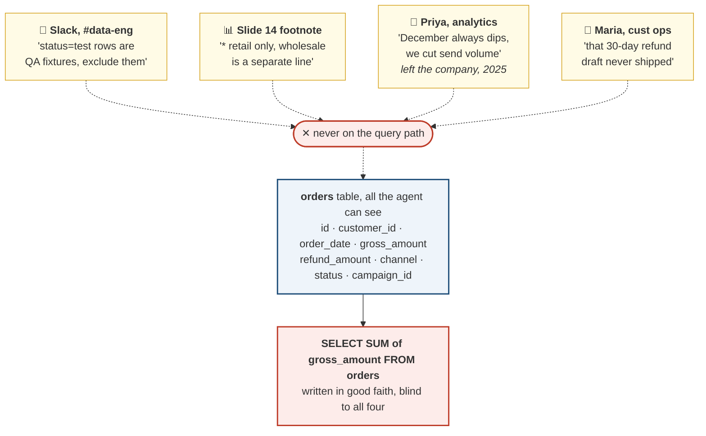
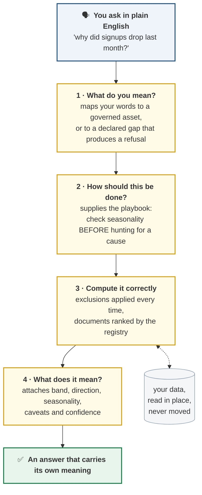
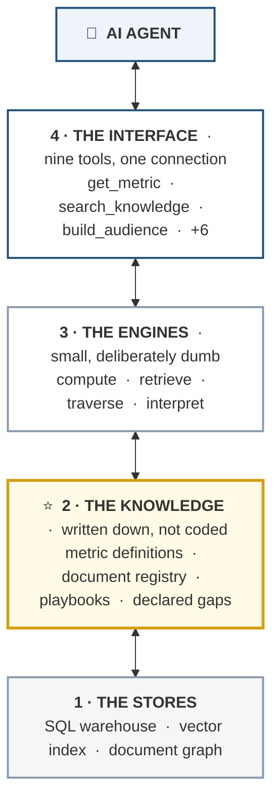
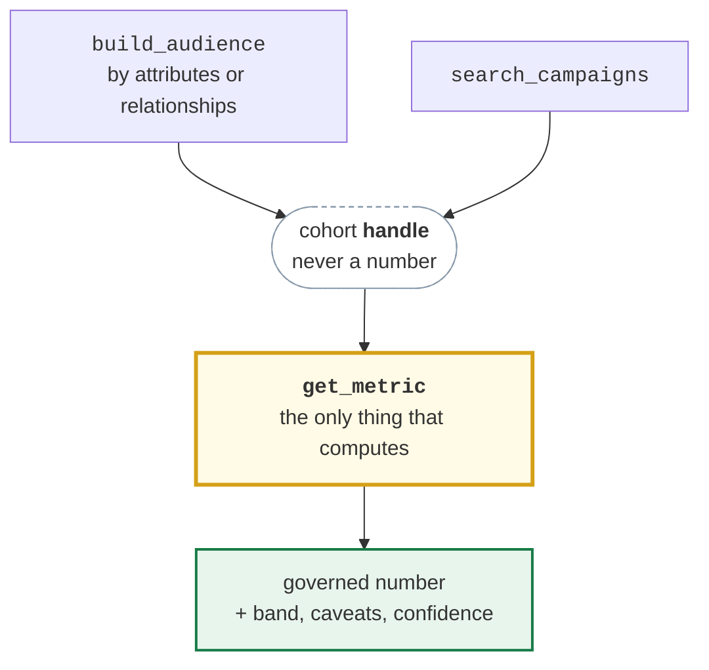

# A Semantic Layer for AI Agents

> **The problem in one sentence:** when you give an AI agent access to your data,
> it will answer every question confidently, and some of those answers will be
> wrong in ways nobody catches.

Not wrong because the model is weak. Wrong because **the data does not carry its
own meaning**, and the agent has no way to know what it is missing.

This is a working proof of concept of the fix.

**Jump to:** [The evidence](#the-evidence) · [Why it happens](#why-the-agent-cannot-fix-this-itself) · [What we built](#what-we-built) · [How it works](#how-it-works) · [The tools](#the-interface-nine-tools-one-connection) · [Run it](#quick-start)

---

## The evidence

A fictitious online tennis retailer with a realistic warehouse. Same questions,
same data, same model, asked two ways.

| Question | Raw database access | With the layer | What went wrong |
|---|---|---|---|
| What was revenue last month? | `$615,188` | **`$425,966`** | Counted QA test orders and the wholesale line |
| How did email open rates do? | `35.15%` | **`23.28%`** | Counted machine opens from privacy proxies |
| Does churn spread through referrals? | *"No, the opposite"* | **Yes, by 11.7 pts** | Invented its own churn definition |

Read the third row again. The agent did not fail to answer. It answered
**confidently, with real numbers, in the wrong direction.** A marketer would have
acted on it.

<details>
<summary><b>The synthetic company behind these numbers</b> (click to expand)</summary>

Everything is generated by [one script](baseline-tennis-poc/data/seed.py), and
generated *adversarially*: it is a test bed, not a random dataset.

| Table | Rows | Notes |
|---|---|---|
| `customers` | 18,000 | 2 segments, 5 acquisition channels, `referred_by` edges |
| `orders` | 91,216 | 83,989 completed · 5,433 refunded · **1,794 test rows** |
| `order_items` | 115,695 | line items to products |
| `products` | 120 | rackets, strings, apparel, shoes, services · 7 brands |
| `campaigns` | 63 | with objective, target, budget, and learnings |
| `email_sends` | 356,002 | **32,473 of 123,962 opens are machine opens** |
| `ad_spend` | 2,006 | with a deliberate 6-month hole in paid social |
| documents | 29 | 14,318 words, every one over 50 lines |

**Every trap is planted on purpose, and every trap has a question that hunts it:**

- QA test rows and wholesale rows inflate naive revenue by **44%**
- A quarter of email opens were never performed by a human
- A 2024 refund policy draft that was **never adopted** and does not say so
- A recap deck quoting gross where the governed metric is net
- A documented paid-search pause matching a real 37% signup drop

**Gaps are planted with equal care**, because knowing what you cannot answer is
part of the job: no satisfaction/NPS data anywhere, no multi-touch attribution,
no stock history, churn inferred rather than observed.

**It checks its own work.** After generating, the seeder asserts every planted
signal actually materialized, so the demo cannot pass by luck. It also publishes
the correct answers to `seed_facts.json`, so the eval never rots when the data is
regenerated. Fixed seed 42: same clone, same warehouse.

</details>

---

## Why the agent cannot fix this itself

**The information it needs is not in the data.** It is in Slack threads, slide
footnotes, and people's heads.



A table called `orders` does not say that `status = 'test'` rows are QA artifacts
in production. A column called `opened` does not say a third of those were image
prefetches. And documents are worse than tables:

> **A policy written in 2024 does not say "I was replaced in 2026."** Nobody went
> back to stamp it, because the person writing the replacement had no way to reach
> every copy of the old one. It reads as confident and complete, because it was, once.

**The agent is not careless. Its whole world is the schema.**

---

## What we built

A machine-readable knowledge system between the agent and the data. For any
question, it supplies four things the raw data cannot:

| | Supplies | Meaning |
|---|---|---|
| **1** | **What exists** | A catalog of every queryable thing: metrics, tables, documents, and the paths that reach them |
| **2** | **What it means** | Definitions, formulas, exclusions, caveats, limitations. "Revenue" is not a column, it is a definition with rules attached |
| **3** | **How to get it** | One governed path per asset. The engine applies exclusions automatically, and raw SQL is not offered |
| **4** | **How to interpret it** | The part most implementations skip. Every number arrives with its band, direction, seasonality, caveats, and confidence |

### The same question, answered properly

> **"How did email open rates do last month?"**
>
> **23.3 percent**, `within the normal band of 22.7 to 25.1 percent` for this time
> of year. This counts `human opens only: machine opens from privacy proxies are
> excluded`, as is transactional mail, so it is `not comparable to a raw open rate
> from another tool`. `Open rate is directional only since Apple Mail Privacy
> Protection`. `Click rate, at 3.1 percent, is the more reliable signal` for
> campaign decisions.

A number, a judgment, the definition, the caveat, and what to look at instead.

---

## What this makes possible

<table>
<tr>
<td width="50%" valign="top">

### ✅ It gets the number right

Exclusions live **inside** the metric. Applied every time, not because the agent
remembered, but because **there is no path that skips them**.

</td>
<td width="50%" valign="top">

### 📅 It knows which document is current

Documents do not declare their own status, so a **registry** tracks it externally:
in force, superseded, never adopted. The same role a CMS plays in a real company.

</td>
</tr>
<tr>
<td width="50%" valign="top">

### 🚫 It says "I don't know" when it should

The layer **declares what the business lacks**, so an honest refusal is guaranteed
rather than hoped for.

*"What's our NPS?"* → no satisfaction data exists anywhere; here are two adjacent
behavioral signals, and neither measures sentiment.

</td>
<td width="50%" valign="top">

### 🧩 It extends without rewriting

Graph traversal was added as **content, not code**. The router never learned what
a graph is. A new metric is a YAML file with no program behind it.

</td>
</tr>
</table>

**The boundaries are precise, too.** *"Are we out of stock?"* is answerable.
*"How long have we been out?"* is not, because no movement history exists. The
layer says so rather than estimating.

---

## Why this is worth doing

- **Wrong answers are expensive and invisible.** A 44% revenue overstatement does
  not announce itself. Someone builds a forecast on it, and the failure surfaces a
  quarter later attached to a decision nobody can trace back.
- **Definitions drift without one.** Three teams asking "what is revenue" get three
  numbers, and the meeting becomes about whose number is right.
- **Confident nonsense erodes trust faster than "I don't know" ever does.** A tool
  that occasionally invents an answer gets abandoned, because checking it costs
  more than doing the work yourself.
- **The knowledge already exists, in people's heads.** Someone knows about the test
  rows. Someone knows December dips. That knowledge leaves when they do.

---

## How it works

### What happens to a question



### The architecture

**Almost everything is written knowledge rather than program logic.** The agent
only ever touches the top tier.



Every request passes **through** the knowledge tier: the engines consult it to
learn what a metric excludes and which document is in force, and it is the only
tier that could not be derived from the data underneath it.

| Tier | Holds | Line count |
|---|---|---|
| **Knowledge** | metric definitions, document registry, playbooks, ontology | ~3,800 |
| **Engines** | compute, retrieve, traverse, interpret | ~2,900 |

The split matters more than the ratio: **not one line of the engine knows what
revenue means.** Adding a metric is a new YAML file. Adding a question type is a
new playbook. Both were done during this build with no program change.

### Why several stores

| Store | Good at | Example |
|---|---|---|
| **SQL warehouse** | exact, additive arithmetic over rows | *"Revenue in July, by channel"* |
| **Vector index** | meaning that survives paraphrase | *"Can customers send things back"* finds the Refund Policy |
| **Document graph** | how documents relate to each other | *"Which policies apply to racket discounting"* lives in no single passage |

Customer chains (*"referrals of referrals"*) need **no extra store**: they run as
recursive queries on the warehouse itself, so a traversal can never disagree with
the data it walks.

### The one rule that holds it together



> **Selection tools select populations. Only the metrics engine computes.**

However a population was found, its number comes through the same governed
definition with the same exclusions. A number worked out any other way is not the
governed metric, **even when the arithmetic is right**.

---

## The interface: nine tools, one connection

You never choose between them. You ask in plain language and the layer routes it.

| Tool | What you would ask it |
|---|---|
| `get_started` | *What can I even ask about here?* |
| `list_metrics` | *What numbers do you track?* |
| `get_playbook` | *What is the right way to approach this kind of question?* |
| `discover_assets` | *Do we have anything on customer satisfaction?* |
| **`get_metric`** ⚙️ | *What was revenue last month?* |
| `search_knowledge` | *What is our refund policy?* · *Which policies apply to racket discounting?* |
| `search_campaigns` 🔍 | *What did we learn from our restring campaigns?* |
| `category_affinity` | *What should we cross-sell to someone who bought a racket?* |
| `build_audience` 🔍 | *Who should I send this promotion to?* · *Which channel produced our best referral chains?* |

⚙️ = the only tool that computes · 🔍 = selects, then hands off

**Routing is most of what the layer is for.** It knows that *"how much did we
make"* is a governed metric, *"what does the policy say"* is a document, and
*"search the documents for our revenue"* is **a metric question wearing a
disguise**. Getting that last one wrong is how an agent quotes a stale figure out
of a slide deck.

---

## What it is not

| ✗ Not | Because |
|---|---|
| **A copy of your data** | It stores meaning and pointers, and reads your warehouse in place |
| **Documentation** | Documentation is optional and goes stale quietly. This is machine-enforced and travels with every result |
| **A replacement for analysts** | It encodes what they already know, so it scales past their calendars and survives them leaving |
| **One giant company-wide ontology** | Those projects fail. This is a small shared spine with self-contained domain packages |

---

## Quick start

Requires Python 3.11. Everything runs locally; the demo needs no API key.

```bash
cd baseline-tennis-poc
python3.11 -m venv .venv
.venv/bin/pip install -r requirements.txt
.venv/bin/python data/seed.py                    # generate the warehouse + documents
.venv/bin/python cli.py index                    # build the vector index
.venv/bin/python eval/verify_layer.py            # 313 checks, no model involved
```

Then [register the MCP server](baseline-tennis-poc/README.md#register-with-claude)
with Claude Desktop or Claude Code.

> The warehouse, document corpus, and vector index are **generated, not
> committed**. Seeding is deterministic, so a fresh clone reproduces them exactly.

### How it is verified

| Command | Checks |
|---|---|
| `eval/verify_layer.py` | 313 checks over the whole layer |
| `eval/verify_knowledge_graph.py` | 16 checks on relationship retrieval |
| `eval/verify_marketer_coverage.py` | 74 real marketer questions route or decline |
| `eval/probe_mcp.py` | the MCP protocol boundary |
| `eval/probe_cohort.py` | cohort handles over the wire |

**403 deterministic checks, no model involved.** There is also a scored
25-question suite that runs a real model with and without governance, and a
routing probe that isolates tool descriptions from everything else. Both are
documented in the [operator guide](baseline-tennis-poc/README.md#running-the-scored-eval),
including the one adversarial case that still misroutes.

---

## Repository map

| Path | What |
|---|---|
| [baseline-tennis-poc/README.md](baseline-tennis-poc/README.md) | **The operator's manual**: build, run, verify, demo script |
| [semantic-layer-explained.html](semantic-layer-explained.html) | The same argument as an illustrated page |
| [PLAN.md](PLAN.md) | The original build plan |
| `baseline-tennis-poc/semantic-layer/` | The knowledge: definitions, registry, playbooks, ontology |
| `baseline-tennis-poc/src/` | The engines, containing no business knowledge |
| `baseline-tennis-poc/mcp_server.py` | Nine tools. `run_sql` is never among them |
| `baseline-tennis-poc/data/seed.py` | Generates the whole synthetic company |
| `baseline-tennis-poc/eval/` | 403 deterministic checks plus the scored suite |

---

## The short version

**Raw data + a capable AI** → confident answers, some wrong, and you cannot tell
which from looking at them.

**The same AI + a semantic layer** → answers that are correct, carry their own
caveats, and refuse honestly when the data does not support the question.

> **The difference is not the model. It is whether the meaning was written down.**
